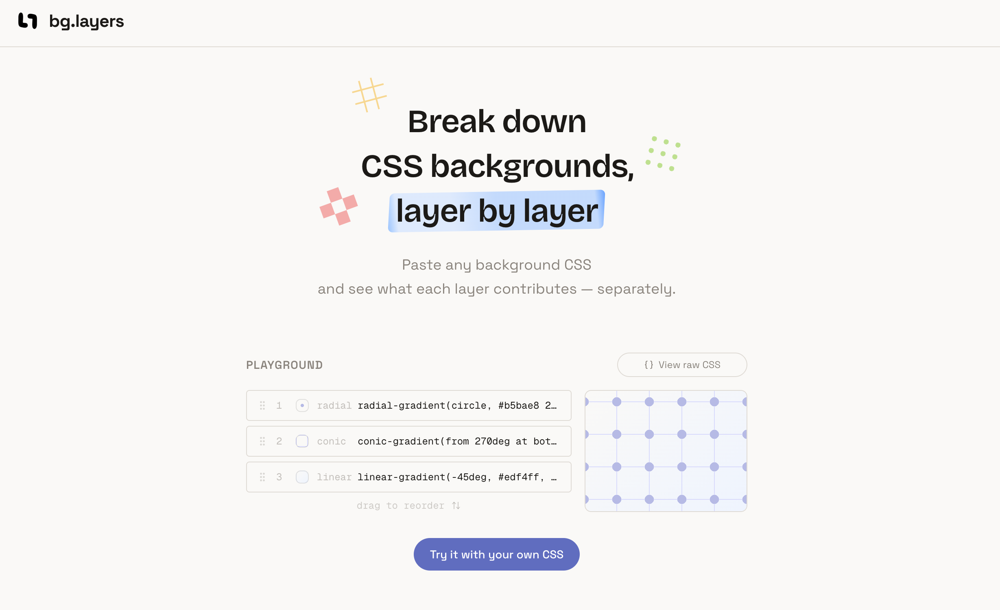

# bg.layers

A CSS background layer debugger and editor. Paste a `background` shorthand or individual `background-*` properties, inspect each layer, reorder or hide them, and copy the output CSS.

**[bg-layers.vercel.app](https://bg-layers.vercel.app/)**

## Supported Properties

- `background` (shorthand)
- `background-image`, `background-color`
- `background-position`, `background-size`
- `background-repeat`, `background-attachment`
- `background-origin`, `background-clip`
- `background-blend-mode`

## Running the Code

Run `npm i` to install the dependencies.

Run `npm run dev` to start the development server.

## Credits

- [CodeMirror](https://codemirror.net)
- [Motion](https://motion.dev)
- [shadcn/ui](https://ui.shadcn.com)
- [hit-area](https://bazza.dev/craft/2026/hit-area)
- UI polish with [Impeccable](https://impeccable.style/)

## License

MIT
